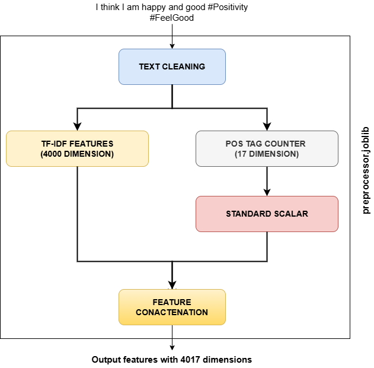
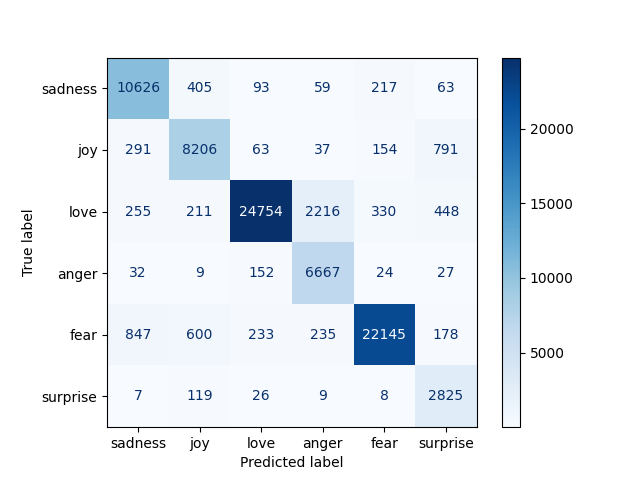
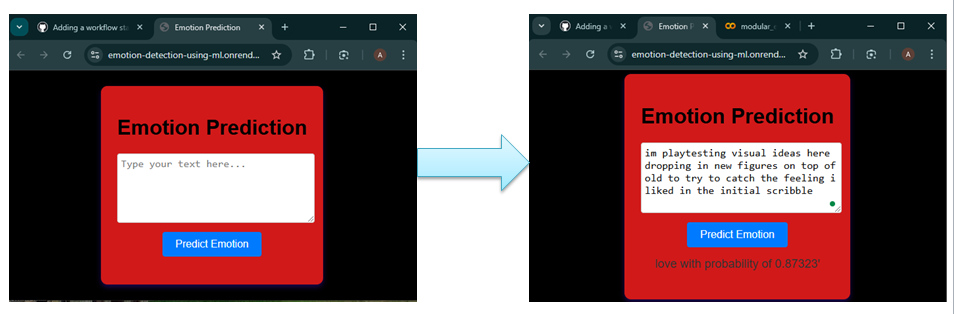

# Emotion Detection using ML


\


  

"Emotion Detection using ML" is a highly modular, end-to-end, pipelined, production-grade machine learning project that focuses on detecting emotions from Twitter text data. The project follows all the data science lifecycle steps from data collection to model deployment by conforming to best practices. Using a project like this in real time, a social media platform like Twitter can analyse sentiments for brand monitoring, identify and respond to customer complaints, or analyse the perspective of a user around political and social concerns for better content recommendation.

  
  

## Author(s)

**Arghyadip Bagchi**

* LinkedIn profile: https://linkedin.com/in/arghyadip-bagchi
* Kaggle profile: https://www.kaggle.com/arghyadipbagchi

  

## How to setup?

Follow these steps to set up and run the project on your local machine:

### Step 1: Clone the repository
First, clone the project repository using the following command:

```
https://github.com/ArghyadipB/Emotion-Detection-using-ML.git
```
### Step 2: Navigate into the project directory
Change into the directory of the cloned repository:

```
cd Emotion-Detection-using-ML
```

### Step 3: Step 3: Create a virtual environment
Create a new Conda environment for the project:

```
conda create -n venv python=3.9.2 -y
```
### Step 4: Activate the environment
Activate the newly created environment:

```
conda activate venv
```
### Step 5: Install the required dependencies
Install the project dependencies from the `requirements.txt` file:

```
pip install -r requirements.txt
```
### Step 6: Run the application locally
Start the Flask application locally using the following command:

```
python app.py
```
Once the app is running, it will be available in your browser at http://localhost:5000.
  
## Features

  

* Emotion detection from twitter text

* Fast training and prediction

* Experiment tracking using MLFlow in Dagshub

* Automated CI/CD pipeline using Github Actions

* Deployment in Render

  

## Tech Stack

  

*  **Exploratory data analysis** : Numpy, pandas, Matplotlib

*  **Feature Engineering & model Development**: nltk, scikit-learn

*  **Deployment and Tracking** : mlflow, dagshub, gunicorn, render & flask

  

## Link(s)

  

* The app is deployed in Render and can be interacted with using: https://emotion-detection-using-ml.onrender.com/

* Dagshub experiment link: https://shorturl.at/JuN9i

  

## Project Description and Workflow

  

The project follows a file structure used in this repo [1]. As a result, the whole project is divided into six stages, namely:

  
### Data Ingestion
 In this step, we get the raw data from the data source. Here we get the **"Twitter Emotion Classification Dataset"** [2] from Kaggle and save it in our local system inside the `artifacts\data_ingestion` folder for further processing and cleaning. The dataset has 416809 rows and two columns: a 'text' column and a multiclass 'label' column, having classes labelled as 'sadness', 'joy', 'love', 'anger', 'fear', 'surprise'. The raw data is then saved inside a folder called Data Ingestion. 

  
### Data validation
 This step involves whether the data is matching certain criteria or not so that the data quality can be verified. In our project, we just validate the columns if they match the predefined set of columns or not. Upon successful verification, we save a text file with the `Validation Status` in True or False.

  
### Data Transformation
 In this step, if the `Validation Status` is "True," we begin by performing exploratory data analysis (EDA), followed by data cleaning, transformations, and feature generation. These processes prepare the data for training our machine learning model. The sequence starts with data analysis, followed by splitting the data into training and testing in a stratified way with a ratio of 0.2, and then proceeds with cleaning, transforming, and generating features. Here is a flow diagram of how numerical features are generated in a pipelined way:


 
After the whole preprocessing part, we are left with a training shape of (333447, 4017) and a testing shape of (83362, 4017). Finally, we save the whole pipeline for future production-level prediction along with the independent and dependent columns from the train and test sets in different joblib files inside the `artifacts\data_transformation` folder.

  
### Model Training
Generated high-dimensional features are directly given to logistic regression for multiclass classification with class_weight set as 'balanced' and with a max_iterations of 1000, penalty set as 'L2', random_state as 42, solver as 'lbfgs', and n_jobs as -1. The model should take 48–53 seconds to train. The use of class_weight as 'balanced' is an important point to note, as the data is imbalanced across classes, and 'balanced' training enables the model to employ different weights to different classes based on their count. At the end of the training, we save the model as a 'log_reg_model.joblib' file inside the `artifacts\model_trainer` folder.

  
### Model Evaluation
 Our trained model is evaluated on a test set, and metrics used for evaluations are accuracy, weighted precision, weighted recall, and weighted F1 score. Now we save these scores along with the confusion matrix in the `artifacts\model_evaluation` folder as 'metrics.json' and 'confusion_matrix.png' files, respectively. The scores on the test set are:

| Metric             	| Score 	|
|:--------------------	|:-------:	|
| Accuracy           	| 0.902 	|
| Weighted Precision 	| 0.915 	|
| Weighted Recall    	| 0.902 	|
| Weighted F1-Score  	| 0.905 	|

The confusion matrix is shown below:



  

We have also employed MLFlow with Dagshub so that whenever we start a training, the corresponding metrics along with their values can be tracked in real time along with the model used.

  
### Prediction on User Data and Deployment
 To enable emotion classification for a user's tweet, we create a pipeline that integrates our data preprocessor and the trained model. This pipeline is designed to process the input tweet, apply necessary transformations, and predict the corresponding emotion class. We then build a simple web application to provide an interactive user interface. The frontend is created using HTML (stored in the html folder), with styling handled by CSS and JavaScript (stored in the static folder). The backend logic, including handling user input and making predictions, is implemented using the Flask framework, with all the application code organized in the app.py file.
Here is a screenshot of the app predicting emotion from a tweet:
 
 

To manage CI/CD, we define a main.yaml file. The CI workflow checks code quality with Flake8 and runs tests [inspired by this repo [3]] using pytest. The CD workflow automates deployment to Render, triggered only after the successful completion of the previous steps.

  

## Observations and future works:

  

While our model performs well on standard inputs and test sets, it struggles to accurately identify emotions in text containing negations. This limitation can be addressed by implementing negation handling techniques like using the NegSpacy library to get the count of words with positive or negative emotion. For even better performance, deep learning models like BERT or RoBERTa can be considered, although they require more training time and computational resources.

  

## References

  

[1] End-to-End-Wine-Quality-Prediction: https://github.com/entbappy/End-to-End-Wine-Quality-Prediction

[2] Twitter Emotion Classification Dataset: https://www.kaggle.com/datasets/aadyasingh55/twitter-emotion-classification-dataset/data

[3] Linear model testing with pytest: https://github.com/tirthajyoti/Machine-Learning-with-Python/blob/master/Pytest/test_linear_model.py