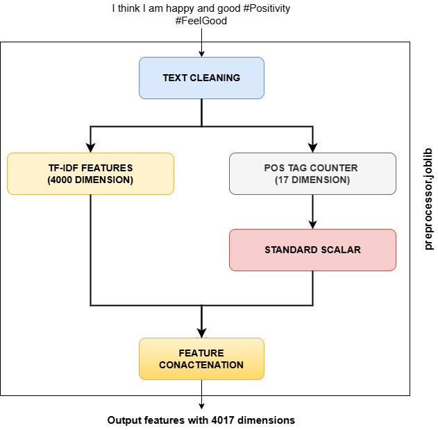

# Emotion Detection using ML

  

"Emotion Detection using ML" is a highly modular, end to end, pipelined, production-grade machine learning project that focuses on detecting emotions from Twitter text data. The project follows all the data science lifecycle steps from data collection to model deployment by conforming to best practices. Using a project like this in real time, a social media platform like Twitter can analyse sentiments for brand monitoring, identify and respond to customer complaints, or analyse the perspective of a user around political and social concerns for better content recommendation.

  
  

## Author(s)

**Arghyadip Bagchi**

* LinkedIn profile: https://linkedin.com/in/arghyadip-bagchi

  

## How to setup?

Step 1: Clone the repo:

```

https://github.com/ArghyadipB/Emotion-Detection-using-ML.git

```

Step 2: Create a conda environment after opening the repository

```

conda create -n venv python=3.8 -y

```

Step 3: Activate the environment

```

conda activate venv

```

  

Step 4: install requirements:

```

pip install -r requirements.txt

```

  

## Features

  

* Emotion detection from twitter text

* Fast training and prediction

* Experiment tracking using MLFlow in Dagshub

* Automated CI/CD pipeline using Github Actions

* Deployment in Render

  

## Tech Stack

  

*  **Exploratory data analysis** : Numpy, pandas, Matplotlib

*  **Feature Engineering & model Development: nltk, scikit-learn

*  **Deployment and Tracking** : mlflow, dagshub, vunicorn, render & flask

  

## Link(s)

  

* The app is deployed in Render and can be interacted with using: https://emotion-detection-using-ml.onrender.com/

* Dagshub experiment link: https://shorturl.at/JuN9i

  

## Project Description and Workflow

  

The project follows a file structure used in this repo [1]. As a result, the whole project is divided into six stages, namely:

  

*  **Data Ingestion**: In this step, we get the raw data from the data source. Here we get the **"Twitter Emotion Classification Dataset"** [2] from Kaggle and save it in our local system for further processing and cleaning. The dataset has 416809 rows and two columns: a 'text' column and a multiclass 'label' column, having classes labelled as 'sadness', 'joy', 'love', 'anger', 'fear', 'surprise'. The raw data is then saved inside a folder called Data Ingestion.

  

*  **Data validation**: This step involves whether the data is matching certain criteria or not so that the data quality can be verified. In our project, we just validate the columns if they match the predefined set of columns or not. Upon successful verification, we save a text file with the "Validation Status" in True or False.

  

*  **Data Transformation**: In this step, if the "Validation Status" is "True," we begin by performing exploratory data analysis (EDA), followed by data cleaning, transformations, and feature generation. These processes prepare the data for training our machine learning model. The sequence starts with data analysis, followed by splitting the data into training and testing in a stratified way with a ratio of 0.2, and then proceeds with cleaning, transforming, and generating features. Here is a flow diagram of how numerical features are generated in a pipelined way:\

\

  

After the whole preprocessing part, we are left with a training shape of (333447, 4017) and a testing shape of (83362, 4017). Finally, we save the whole pipeline for future production level prediction along with the independent and dependent columns from train and test sets in different joblib files inside the data_transformation folder.

  

*  **Model Training**: Generated high-dimensional features are directly given to logistic regression for multiclass classification with class_weight set as 'balanced' and with a max_iterations of 1000, penalty set as 'L2', random_state as 42, solver as 'lbfgs', n_jobs as -1. The model should take 48–53 seconds to train. The use of class_weight as 'balanced' is an important point to note as the data is imbalanced across classes, and 'balanced' training enables the model to employ different weights to different classes based on their count. At the end of the training, we saved the model as a log_reg_model.joblib file inside model_trainer folder.

  

*  **Model Evaluation**: Our trained model is evaluated on a test set, and metrics used for evaluations are accuracy, weighted precision, weighted recall, and weighted F1 score. The scores on test set are:\

"Accuracy": 0.902365586238334 \

"Weighted_precision": 0.9151966484916909 \

"Weighted_recall": 0.902365586238334 \

"Weighted_F1": 0.9051646515755202\

The confusion matrix is shown below:\

\

  

We have also employed MLFlow with Dagshub so that whenever we start a training, the corresponding metrics along with their values can be tracked in real time along with the model used.

  

*  **Prediction on User Data and Deployment**: To enable emotion classification for a user's tweet, we create a pipeline that integrates our data preprocessor and the trained model. This pipeline is designed to process the input tweet, apply necessary transformations, and predict the corresponding emotion class. We then build a simple web application to provide an interactive user interface. The frontend is created using HTML (stored in the html folder), with styling handled by CSS and JavaScript (stored in the static folder). The backend logic, including handling user input and making predictions, is implemented using the Flask framework, with all the application code organized in the app.py file.\

To manage CI/CD, we define a main.yaml file. The CI workflow checks code quality with Flake8 and runs tests [highly influenced by this repo[3]] using pytest. The CD workflow automates deployment to Render, triggered only after the successful completion of the previous steps.

  

## Observations and future works:

  

Even though the model performs well on user inputs and test sets. The model fails poorly if there is any negation in the text, thus can't differentiate between the non-negative and negative emotions. To overcome this, sophisticated negation handling techniques can be used.

  

## References

  

[1] End-to-End-Wine-Quality-Prediction: https://github.com/entbappy/End-to-End-Wine-Quality-Prediction\

[2] Twitter Emotion Classification Dataset: https://www.kaggle.com/datasets/aadyasingh55/twitter-emotion-classification-dataset/data\

[3] Linear model testing with pytest: https://github.com/tirthajyoti/Machine-Learning-with-Python/blob/master/Pytest/test_linear_model.py